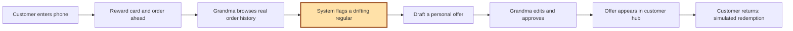

# Bakeria Friends Forever: Vision

October 2, 2026 · Derek Chen

Post-merge update: all three feature branches are merged at `97a9258`. The next-work priorities and UI copy policy are in [NEXT_STEPS.md](NEXT_STEPS.md). API key and Google Form integration are delegated. The original build schedule below is retained as sprint context, not current completion evidence.

## Assumptions and decisions

- Three developers, each with an independent coding agent and checkout. Commit-0 and contracts are prepared by 6:00 PM; 6:00–6:30 is independent setup; implementation is 6:30–8:10 PM. All times are Toronto (EDT).
- One laptop hosts the web app and synthetic data; a phone reaches it on the same network. No auth, payments, POS integration, SMS, email, or native app.
- Product name is **Bakeria Friends Forever** throughout. Grandma's customer dashboard and the customer's hub use the same record.
- The core retention loop is mandatory. The dollar figure is a post-7:30 stretch: estimated monthly revenue at risk. Recovered revenue stays unknown without attributable sales. We will not claim simulated offer approvals are money recovered.
- Order ahead is built into the customer hub. Customers request menu items and a pickup time; Grandma manages upcoming and past orders in the dashboard Orders tab. This user-authorized extension supersedes the original Google Form plan.
- Reward target is ten stamps. All money is CAD. Demo time is fixed for repeatable seed behavior. Technical shapes live only in [CONTRACTS.md](CONTRACTS.md).
- UI principle for the next iteration: every visible sentence should help identify a state, make a decision, or take an action. Remove developer commentary and repeated slogans. Keep useful dates, offer terms, reward value, errors, and one compact demo disclosure; detailed limitations belong in its expandable explanation and the pitch. See the exact copy inventory in NEXT_STEPS.md.

## Overview

Bakeria Friends Forever turns Grandma's memory of her regulars into a customer hub. Customers get a reward card and offers that feel personal. Grandma sees who her regulars are, what they order, and who may be drifting away.

The Bakery can copy a parfait. It can't copy a grandmother who knows your order. Our edge against the chain is the relationship, so the product scales that relationship instead of replacing it with points.

## Vision and goals

Tonight's goal is one working retention loop, with a credible dollar figure if the loop is complete at 7:30.

- **Win back regulars** before they become The Bakery's regulars.
- **Personal at scale.** Every offer sounds like Grandma and uses actual seeded order history.
- **Measurable.** Show returning customers, lapsed regulars, approved offers, and redemptions. Stretch: estimated revenue at risk, in dollars. Ramp is judging; explain how retention could protect the ingredient budget without claiming unmeasured savings.
- **Zero friction.** Join with a phone number, without an app download or password.

Non-goal: replacing the Verifone terminal or handling payments.

## Users

| User | Pain today | What they get |
| --- | --- | --- |
| Customer | Loses punch cards; the chain is convenient | Reward card on their phone, personal offers, built-in order-ahead form |
| Grandma | Remembers preferences but may miss a regular's absence | Sortable regulars list, order history, lapsed alerts, editable personal offers |

Two users, one shared record. A dashboard action must become visible in the customer's hub.

## The demo loop

The highlighted step is the retention hook: noticing a regular's absence relative to their own rhythm. The original embedded diagram was unavailable in the supplied text; this is its explicit replacement.

## Scope and acceptance

| Core feature | Behavior | Done when |
| --- | --- | --- |
| Digital reward card | Phone entry, ten stamps, redeem action; Grandma adds a stamp as mocked checkout | Grandma adds the tenth stamp, the phone updates within two seconds, and redeem resets to zero |
| Grandma's dashboard | Sortable visits, favorite item, last visit, total spend; per-customer order history | All 50 seeded customers can be browsed and detail pages load |
| Lapsed-regular flag | Three or more visits and absence greater than twice usual gap | Seed produces exactly six believable flagged regulars; occasional visitors are not misclassified |
| AI-drafted offer | History-based warm message and free-topping offer; editable approval; cached fallback | Grandma changes a word, approves, and that exact message appears only in the right customer's hub |
| Order ahead | Customer chooses items, quantities, pickup time/name and optional note in the hub | Order persists and appears in Grandma's Upcoming orders; collection moves it to Past |
| Seed data | Fifty customers, three months of orders, meaningful favorites, cached drafts | Every developer starts with identical deterministic data before UI work |
| Core metrics | Returning-customer rate, lapsed count, approved and redeemed offers | Numbers match the seeded records and update after relevant actions |

The simple lapsed rule adapts to the customer: weekly visitors lapse after more than two weeks, monthly visitors after more than two months when enough history exists. Exact formulas and edge cases are in CONTRACTS.md.

### Stretch, only after the 7:30 checkpoint passes

Original sprint stretch priorities were estimated monthly revenue at risk and a favorite-item/flavor summary using existing records. The later authorized order-ahead extension uses the built-in form; the proposed Google Form prefill is obsolete.

Revenue recovered and linked Google Sheet responses are deferred beyond tonight's 100-minute build. They need additional evidence/integration. Unknown recovery is not zero revenue. Do not imply the demo has measured actual customer return or chain switching.

### Out of scope

Kitchen capacity scheduling, real authentication, online payments, POS, SMS/email delivery, native mobile apps, reviews, referrals, multiple stores, and analytics beyond the stretch list. The built-in form records pickup requests; payment remains at the counter.

## Data and team

Four logical tables: menu items, customers, orders, offers. Full schema, request/response definitions, data constraints, seed format, and metric definitions are frozen in CONTRACTS.md. Customers skew toward one or two items so offers have a factual basis.

| Developer | Owns | Handoff |
| --- | --- | --- |
| Dev 1 | Server, persistence, lapsed logic, offer generation, integration | Ready API by 7:15; integrates main |
| Dev 2 | Grandma's dashboard and editable offer workflow | Dashboard feature branch ready by 7:15 |
| Dev 3 | Phone entry, reward card, offers, form link | Customer feature branch and actual form URL ready by 7:15 |

At 7:30, if the loop fails, **all three developers** fix it within their ownership boundaries; no stretch. Code freezes at 8:10. The original event schedule remains: break after 8:30, parfaits at 8:45, demos at 9:30.

## Pitch and two-minute demo

**The Bakery has a chain's budget, but Grandma knows your order. We made that scale.**

1. Explain the copycat chain and Grandma's memory-based customer relationships.
2. Show Maya's phone card and open Order ahead.
3. Show Grandma's customer list, Maya's favorite item, and weekly order history.
4. Highlight Maya's 22-day absence and lapsed flag.
5. Draft an offer, change one word, approve.
6. Switch to Maya's phone and show the exact approved message.
7. Close with estimated revenue at risk if implemented, and the favorite-item insight if available. Explicitly call this a seeded, simulated retention loop.

## Risks and fallbacks

| Risk | Fallback |
| --- | --- |
| Slow or failed LLM | Four-second timeout; per-customer cached draft; visibly label cached preview |
| Late integration | Frozen contracts and seed at commit-0; all branch merges by 7:25 |
| Wi-Fi fails or isolates phone | Laptop hotspot; two browser windows if phone networking fails; screen recording of the successful loop |
| Order submission fails | Keep the selections and request ID for a safe retry; show confirmed orders in both the hub and dashboard |
| Scope creep | Core loop gate at 7:30, stretch stop at 7:50, hard freeze 8:10 |
| JSON persistence limitations | One process and atomic writes; no public deployment or multi-instance setup tonight |
